# Diagramas MVP — Portal Docente G24

> **Índice:** [`diagramas/README.md`](./diagramas/README.md)

Documentación visual del MVP: cadena P1 (login → legajo → Form C → validador) y **P2** (puntaje, junta vocal, mapa Leaflet).

**Herramienta:** [Mermaid](https://mermaid.js.org/) — se renderiza en GitHub y VS Code (Markdown Preview).

**Referencias:** `docs/adr/` · `SCM.md` · Instancia 2 (Sprint 0).

**Leyenda**

| Símbolo | Significado |
|---------|-------------|
| Sólido | Implementado en repo |
| Punteado | Futuro / TBD / fuera MVP UI |
| AS-IS | Sistema legacy (referencia) |
| TO-BE | Portal nuevo (propuesto) |

---

## 1. Contexto del sistema (C4 — nivel 1)

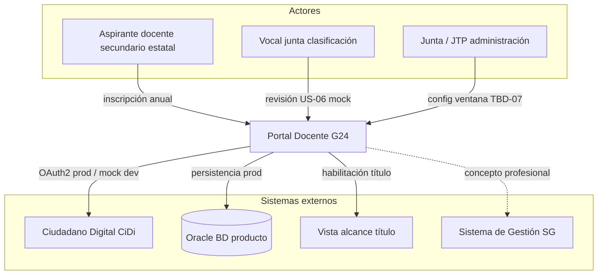
```mermaid
flowchart TB
  subgraph actores [Actores]
    ASP[Aspirante docente secundario estatal]
    VOC[Vocal junta clasificación]
    JTP[Junta / JTP administración]
  end

  subgraph externos [Sistemas externos]
    CIDI[Ciudadano Digital CiDi]
    ORA[(Oracle BD producto)]
    VISTA[Vista alcance título]
    SG[Sistema de Gestión SG]
  end

  PORTAL[Portal Docente G24]

  ASP -->|inscripción anual| PORTAL
  VOC -->|revisión US-06 mock| PORTAL
  JTP -->|config ventana TBD-07| PORTAL

  PORTAL -->|OAuth2 prod / mock dev| CIDI
  PORTAL -->|persistencia prod| ORA
  PORTAL -->|habilitación título| VISTA
  PORTAL -.->|concepto profesional| SG
```

---

## 2. Arquitectura de contenedores (C4 — nivel 2)

Monolito modular (ADR-004). Dev local: fixtures JSON + store en memoria; prod: Oracle (ADR-003).

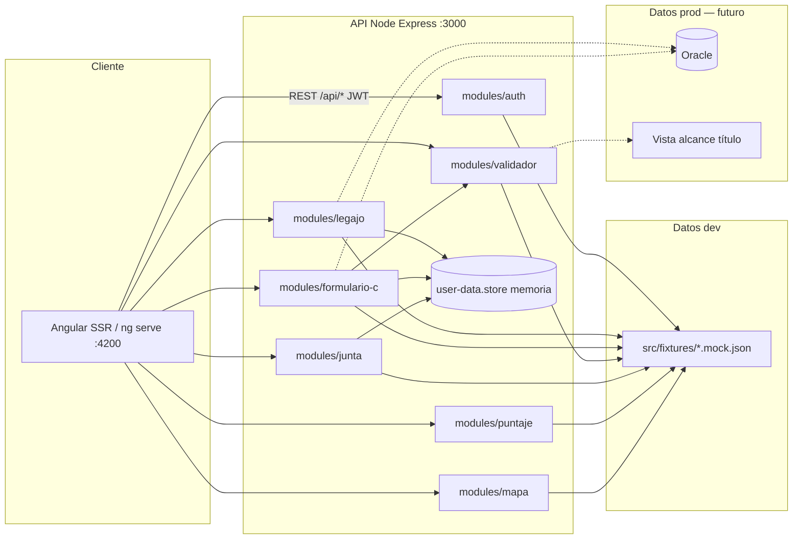
```mermaid
flowchart LR
  subgraph cliente [Cliente]
    WEB[Angular SSR / ng serve :4200]
  end

  subgraph api [API Node Express :3000]
    AUTH[modules/auth]
    LEG[modules/legajo]
    FC[modules/formulario-c]
    VAL[modules/validador]
    JUN[modules/junta]
    PUN[modules/puntaje]
    MAP[modules/mapa]
    STORE[(user-data.store memoria)]
  end

  subgraph datos_dev [Datos dev]
    FIX[src/fixtures/*.mock.json]
  end

  subgraph datos_prod [Datos prod — futuro]
    ORA[(Oracle)]
    VISTA[Vista alcance título]
  end

  WEB -->|REST /api/* JWT| AUTH
  WEB --> LEG
  WEB --> FC
  WEB --> VAL
  WEB --> JUN
  WEB --> PUN
  WEB --> MAP

  AUTH --> FIX
  LEG --> FIX
  LEG --> STORE
  FC --> FIX
  FC --> STORE
  FC --> VAL
  VAL --> FIX
  JUN --> FIX
  JUN --> STORE
  PUN --> FIX
  MAP --> FIX

  LEG -.-> ORA
  FC -.-> ORA
  VAL -.-> VISTA
```

---

## 3. Despliegue local vs producción

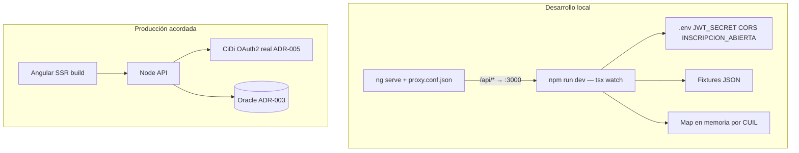
```mermaid
flowchart TB
  subgraph dev [Desarrollo local]
    NG[ng serve + proxy.conf.json]
    API[npm run dev — tsx watch]
    ENV[.env JWT_SECRET CORS INSCRIPCION_ABIERTA]
    FX[Fixtures JSON]
    MEM[Map en memoria por CUIL]
  end

  subgraph prod [Producción acordada]
    SSR[Angular SSR build]
    NODE[Node API]
    OAUTH[CiDi OAuth2 real ADR-005]
    ORA[(Oracle ADR-003)]
  end

  NG -->|/api/* → :3000| API
  API --> ENV
  API --> FX
  API --> MEM

  SSR --> NODE
  NODE --> OAUTH
  NODE --> ORA
```

---

## 4. Componentes backend (capas por módulo)

Patrón repetido en cada US: **routes → controller → service → fixtures/store**.

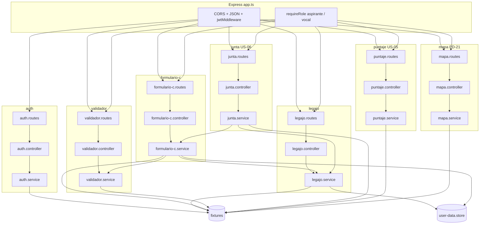
```mermaid
flowchart TB
  subgraph express [Express app.ts]
    MW[CORS + JSON + jwtMiddleware]
    RL[requireRole aspirante / vocal]
  end

  subgraph auth [auth]
    AR[auth.routes]
    AC[auth.controller]
    AS[auth.service]
  end

  subgraph legajo [legajo]
    LR[legajo.routes]
    LC[legajo.controller]
    LS[legajo.service]
  end

  subgraph formc [formulario-c]
    FR[formulario-c.routes]
    FC[formulario-c.controller]
    FS[formulario-c.service]
  end

  subgraph val [validador]
    VR[validador.routes]
    VC[validador.controller]
    VS[validador.service]
  end

  subgraph junta [junta US-06]
    JR[junta.routes]
    JC[junta.controller]
    JS[junta.service]
  end

  subgraph puntaje [puntaje US-05]
    PR[puntaje.routes]
    PC[puntaje.controller]
    PS[puntaje.service]
  end

  subgraph mapa [mapa PD-21]
    MR[mapa.routes]
    MC[mapa.controller]
    MS[mapa.service]
  end

  MW --> AR & LR & FR & VR & JR & PR & MR
  RL --> LR & FR & VR & JR & PR & MR
  AR --> AC --> AS
  LR --> LC --> LS
  FR --> FC --> FS
  VR --> VC --> VS
  JR --> JC --> JS
  PR --> PC --> PS
  MR --> MC --> MS

  FS --> VS
  FS --> LS
  JS --> LS
  JS --> FS
  LS --> STORE[(user-data.store)]
  FS --> STORE
  AS & LS & FS & VS & JS & PS & MS --> FIX[(fixtures)]
```

---

## 5. Frontend — rutas y features

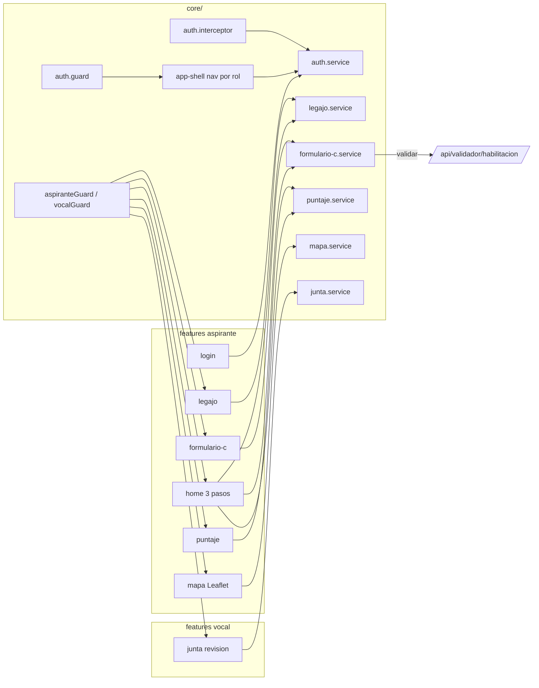
```mermaid
flowchart LR
  subgraph core [core/]
    AUTH_S[auth.service]
    AUTH_G[auth.guard]
    ROLE_G[aspiranteGuard / vocalGuard]
    AUTH_I[auth.interceptor]
    SHELL[app-shell nav por rol]
    LEG_S[legajo.service]
    FC_S[formulario-c.service]
    PUN_S[puntaje.service]
    MAP_S[mapa.service]
    JUN_S[junta.service]
  end

  subgraph aspirante [features aspirante]
    LOGIN[login]
    HOME[home 3 pasos]
    LEG[legajo]
    FORM[formulario-c]
    PUN[puntaje]
    MAP[mapa Leaflet]
  end

  subgraph vocal [features vocal]
    JUN[junta revision]
  end

  LOGIN --> AUTH_S
  SHELL --> AUTH_S
  HOME --> LEG_S & FC_S & PUN_S
  LEG --> LEG_S
  FORM --> FC_S
  PUN --> PUN_S
  MAP --> MAP_S
  JUN --> JUN_S
  FC_S -->|validar| VAL_API[/api/validador/habilitacion/]

  AUTH_G --> SHELL
  ROLE_G --> HOME & LEG & FORM & PUN & MAP & JUN
  AUTH_I --> AUTH_S
```

**Rutas:** `/login` · `/home` · `/legajo` · `/formulario-c` · `/puntaje` · `/mapa` (aspirante) · `/junta` (vocal).

---

## 6. Cadena de negocio TO-BE (MVP codeado)

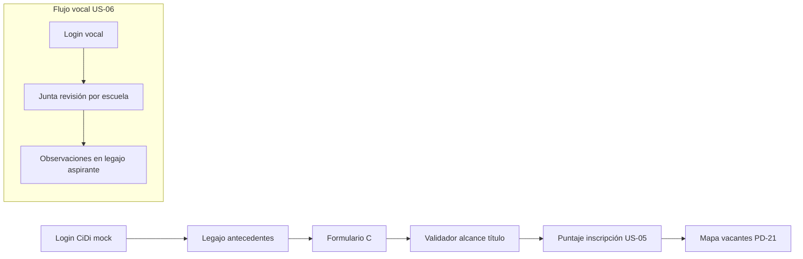
```mermaid
flowchart LR
  A[Login CiDi mock] --> B[Legajo antecedentes]
  B --> C[Formulario C]
  C --> D[Validador alcance título]
  D --> E[Puntaje inscripción US-05]
  E --> F[Mapa vacantes PD-21]

  subgraph vocal [Flujo vocal US-06]
    V[Login vocal] --> J[Junta revisión por escuela]
    J --> O[Observaciones en legajo aspirante]
  end
```

Comparación AS-IS legacy (solo referencia):

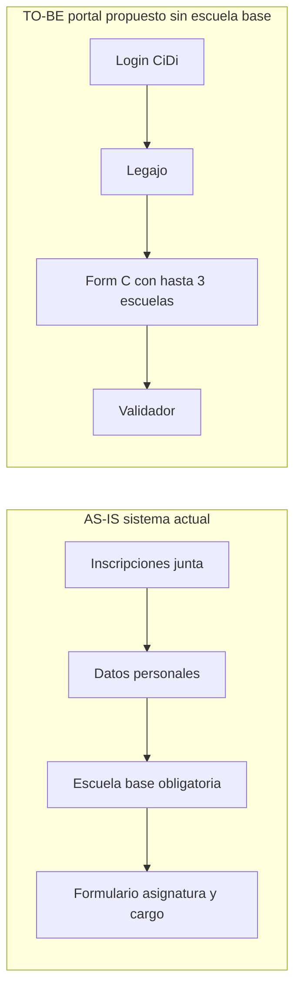
```mermaid
flowchart LR
  subgraph asis [AS-IS sistema actual]
    L1[Inscripciones junta] --> L2[Datos personales]
    L2 --> L3[Escuela base obligatoria]
    L3 --> L4[Formulario asignatura y cargo]
  end

  subgraph tobe [TO-BE portal propuesto sin escuela base]
    T1[Login CiDi] --> T2[Legajo]
    T2 --> T3[Form C con hasta 3 escuelas]
    T3 --> T4[Validador]
  end
```

---

## 7. Diagrama de clases — dominio (conceptual)

Entidades de negocio. Algunos atributos son **TBD** (marcados).

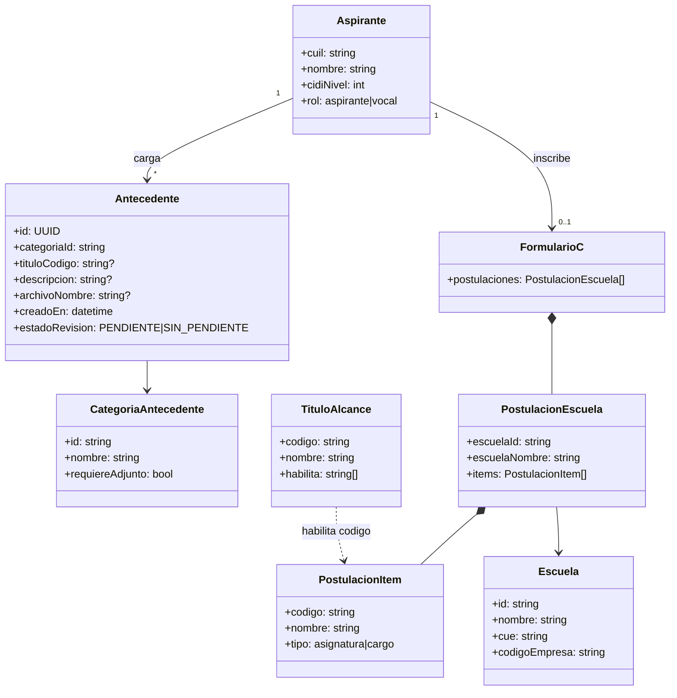
```mermaid
classDiagram
  class Aspirante {
    +cuil: string
    +nombre: string
    +cidiNivel: int
    +rol: aspirante|vocal
  }

  class Antecedente {
    +id: UUID
    +categoriaId: string
    +tituloCodigo: string?
    +descripcion: string?
    +archivoNombre: string?
    +creadoEn: datetime
    +estadoRevision: PENDIENTE|SIN_PENDIENTE
  }

  class CategoriaAntecedente {
    +id: string
    +nombre: string
    +requiereAdjunto: bool
  }

  class FormularioC {
    +postulaciones: PostulacionEscuela[]
  }

  class PostulacionEscuela {
    +escuelaId: string
    +escuelaNombre: string
    +items: PostulacionItem[]
  }

  class PostulacionItem {
    +codigo: string
    +nombre: string
    +tipo: asignatura|cargo
  }

  class Escuela {
    +id: string
    +nombre: string
    +cue: string
    +codigoEmpresa: string
  }

  class TituloAlcance {
    +codigo: string
    +nombre: string
    +habilita: string[]
  }

  Aspirante "1" --> "*" Antecedente : carga
  Antecedente --> CategoriaAntecedente
  Aspirante "1" --> "0..1" FormularioC : inscribe
  FormularioC *-- PostulacionEscuela
  PostulacionEscuela *-- PostulacionItem
  PostulacionEscuela --> Escuela
  TituloAlcance ..> PostulacionItem : habilita codigo
```

---

## 8. Diagrama de clases — backend (implementación)

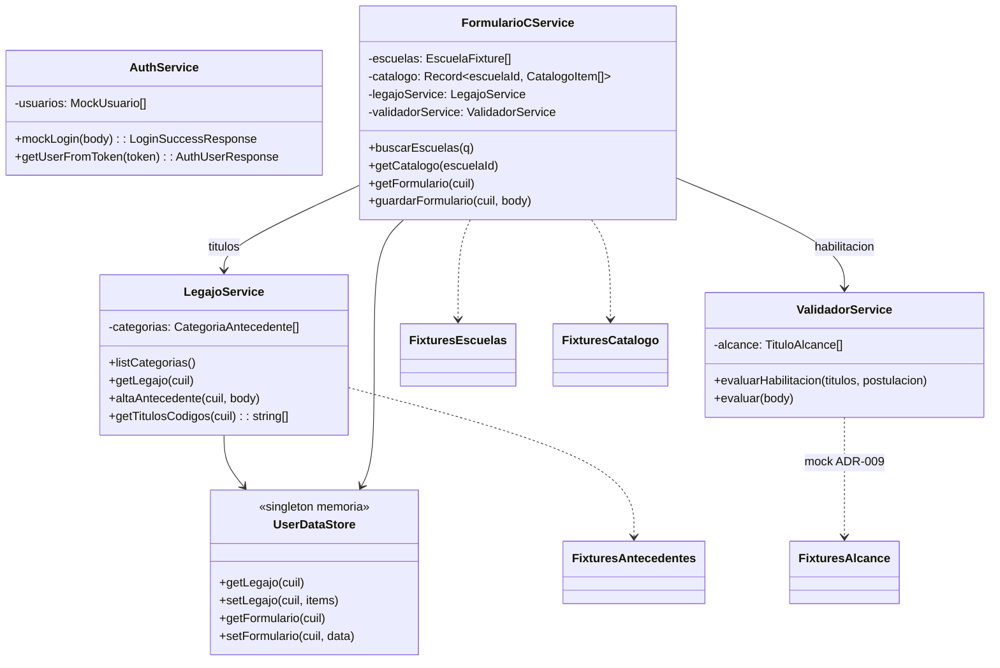
```mermaid
classDiagram
  direction TB

  class AuthService {
    -usuarios: MockUsuario[]
    +mockLogin(body): LoginSuccessResponse
    +getUserFromToken(token): AuthUserResponse
  }

  class LegajoService {
    -categorias: CategoriaAntecedente[]
    +listCategorias()
    +getLegajo(cuil)
    +altaAntecedente(cuil, body)
    +getTitulosCodigos(cuil): string[]
  }

  class FormularioCService {
    -escuelas: EscuelaFixture[]
    -catalogo: Record~escuelaId, CatalogoItem[]~
    -legajoService: LegajoService
    -validadorService: ValidadorService
    +buscarEscuelas(q)
    +getCatalogo(escuelaId)
    +getFormulario(cuil)
    +guardarFormulario(cuil, body)
  }

  class ValidadorService {
    -alcance: TituloAlcance[]
    +evaluarHabilitacion(titulos, postulacion)
    +evaluar(body)
  }

  class UserDataStore {
    <<singleton memoria>>
    +getLegajo(cuil)
    +setLegajo(cuil, items)
    +getFormulario(cuil)
    +setFormulario(cuil, data)
  }

  FormularioCService --> LegajoService : titulos
  FormularioCService --> ValidadorService : habilitacion
  LegajoService --> UserDataStore
  FormularioCService --> UserDataStore
  ValidadorService ..> FixturesAlcance : mock ADR-009
  LegajoService ..> FixturesAntecedentes
  FormularioCService ..> FixturesEscuelas
  FormularioCService ..> FixturesCatalogo
```

Constantes de negocio en código:

| Constante | Valor | Fuente |
|-----------|-------|--------|
| `MAX_ESCUELAS` | 3 | Acta junta |
| `MAX_ITEMS_POR_ESCUELA` | 5 | Acta junta [36:00] |
| `CIDI_NIVEL_MINIMO` | 2 | Política CiDi mock |

---

## 9. Diagrama de clases — frontend

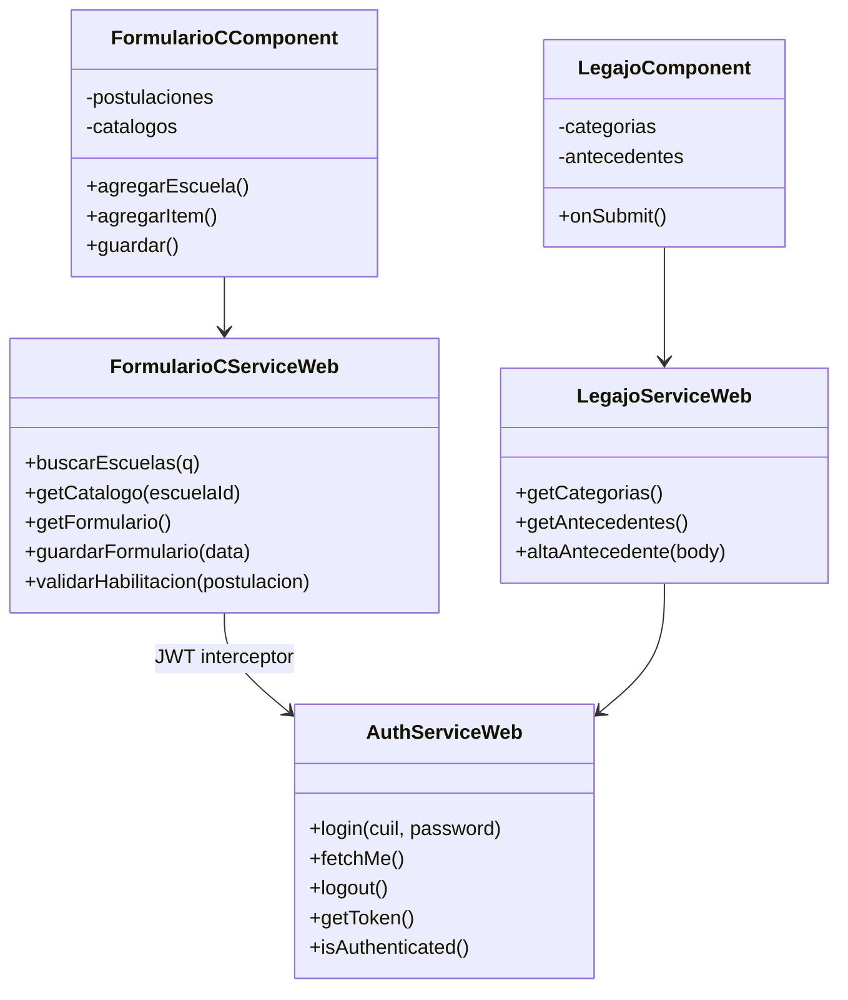
```mermaid
classDiagram
  class AuthServiceWeb {
    +login(cuil, password)
    +fetchMe()
    +logout()
    +getToken()
    +isAuthenticated()
  }

  class LegajoServiceWeb {
    +getCategorias()
    +getAntecedentes()
    +altaAntecedente(body)
  }

  class FormularioCServiceWeb {
    +buscarEscuelas(q)
    +getCatalogo(escuelaId)
    +getFormulario()
    +guardarFormulario(data)
    +validarHabilitacion(postulacion)
  }

  class LegajoComponent {
    -categorias
    -antecedentes
    +onSubmit()
  }

  class FormularioCComponent {
    -postulaciones
    -catalogos
    +agregarEscuela()
    +agregarItem()
    +guardar()
  }

  LegajoComponent --> LegajoServiceWeb
  FormularioCComponent --> FormularioCServiceWeb
  FormularioCServiceWeb --> AuthServiceWeb : JWT interceptor
  LegajoServiceWeb --> AuthServiceWeb
```

---

## 10. Estados — sesión del aspirante y vocal

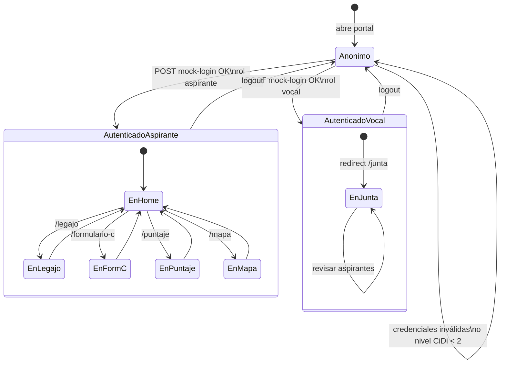
```mermaid
stateDiagram-v2
  [*] --> Anonimo : abre portal

  Anonimo --> AutenticadoAspirante : POST mock-login OK\nrol aspirante
  Anonimo --> AutenticadoVocal : POST mock-login OK\nrol vocal
  Anonimo --> Anonimo : credenciales inválidas\no nivel CiDi < 2

  state AutenticadoAspirante {
    [*] --> EnHome
    EnHome --> EnLegajo : /legajo
    EnLegajo --> EnHome
    EnHome --> EnFormC : /formulario-c
    EnFormC --> EnHome
    EnHome --> EnPuntaje : /puntaje
    EnPuntaje --> EnHome
    EnHome --> EnMapa : /mapa
    EnMapa --> EnHome
  }

  state AutenticadoVocal {
    [*] --> EnJunta : redirect /junta
    EnJunta --> EnJunta : revisar aspirantes
  }

  AutenticadoAspirante --> Anonimo : logout
  AutenticadoVocal --> Anonimo : logout
```

---

## 11. Estados — carga de antecedente (dominio)

Estados `PENDIENTE` / `SIN_PENDIENTE` / `RECHAZADO` (US-06). El vocal puede rechazar con observación; el aspirante la ve en `/legajo`.

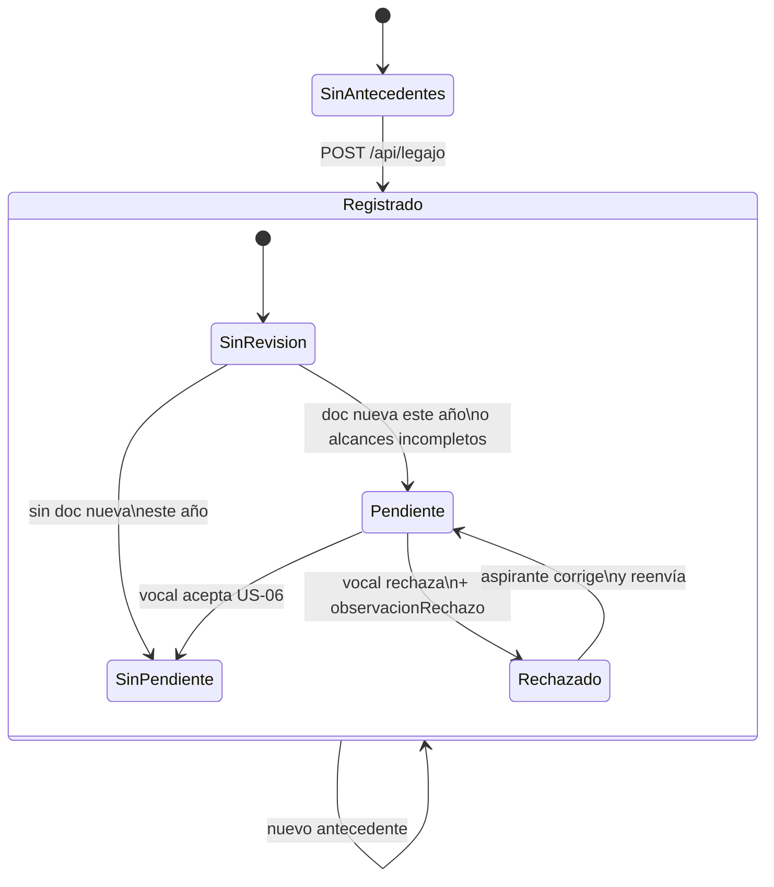
```mermaid
stateDiagram-v2
  [*] --> SinAntecedentes

  SinAntecedentes --> Registrado : POST /api/legajo

  state Registrado {
    [*] --> SinRevision
    SinRevision --> Pendiente : doc nueva este año\no alcances incompletos
    SinRevision --> SinPendiente : sin doc nueva\neste año
    Pendiente --> SinPendiente : vocal acepta US-06
    Pendiente --> Rechazado : vocal rechaza\n+ observacionRechazo
    Rechazado --> Pendiente : aspirante corrige\ny reenvía
  }

  Registrado --> Registrado : nuevo antecedente
```

---

## 12. Estados — Formulario C (UI + persistencia)

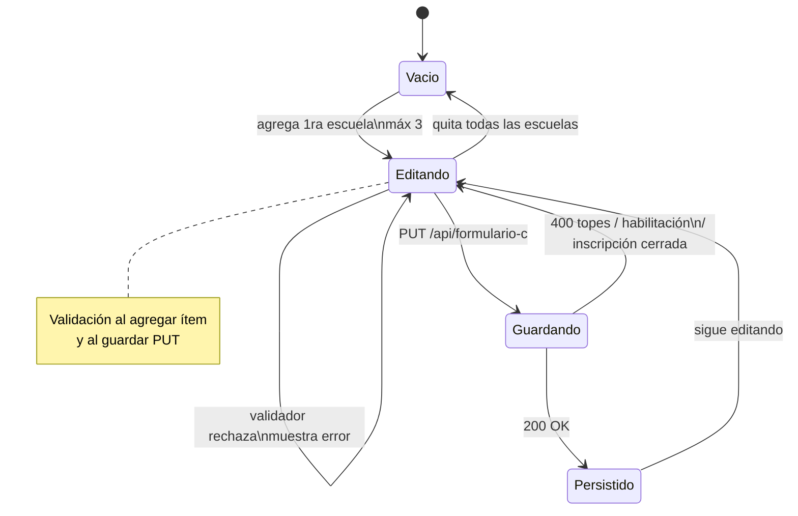
```mermaid
stateDiagram-v2
  [*] --> Vacio

  Vacio --> Editando : agrega 1ra escuela\nmáx 3
  Editando --> Editando : agrega ítem\nvalidador OK\nmáx 5 por escuela
  Editando --> Editando : validador rechaza\nmuestra error
  Editando --> Vacio : quita todas las escuelas

  Editando --> Guardando : PUT /api/formulario-c
  Guardando --> Persistido : 200 OK
  Guardando --> Editando : 400 topes / habilitación\n/ inscripción cerrada

  Persistido --> Editando : sigue editando

  note right of Editando
    Validación al agregar ítem
    y al guardar PUT
  end note
```

---

## 13. Estados — inscripción anual (config)

Flag mock `INSCRIPCION_ABIERTA` (TBD-07). Regla real pendiente junta.

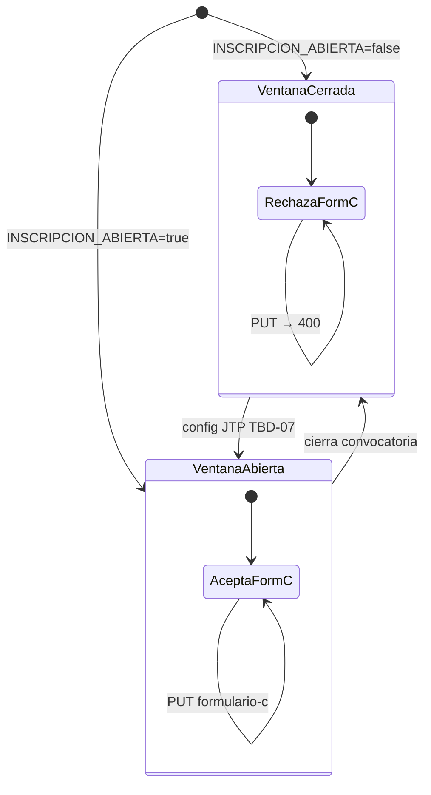
```mermaid
stateDiagram-v2
  [*] --> VentanaCerrada : INSCRIPCION_ABIERTA=false
  [*] --> VentanaAbierta : INSCRIPCION_ABIERTA=true

  VentanaCerrada --> VentanaAbierta : config JTP TBD-07
  VentanaAbierta --> VentanaCerrada : cierra convocatoria

  state VentanaAbierta {
    [*] --> AceptaFormC
    AceptaFormC --> AceptaFormC : PUT formulario-c
  }

  state VentanaCerrada {
    [*] --> RechazaFormC
    RechazaFormC --> RechazaFormC : PUT → 400
  }
```

---

## 14. Secuencia — login mock CiDi

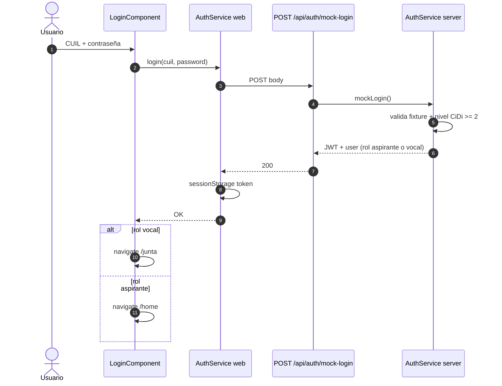
```mermaid
sequenceDiagram
  autonumber
  actor U as Usuario
  participant W as LoginComponent
  participant AS as AuthService web
  participant API as POST /api/auth/mock-login
  participant S as AuthService server

  U->>W: CUIL + contraseña
  W->>AS: login(cuil, password)
  AS->>API: POST body
  API->>S: mockLogin()
  S->>S: valida fixture + nivel CiDi >= 2
  S-->>API: JWT + user (rol aspirante o vocal)
  API-->>AS: 200
  AS->>AS: sessionStorage token
  AS-->>W: OK
  alt rol vocal
    W->>W: navigate /junta
  else rol aspirante
    W->>W: navigate /home
  end
```

---

## 15. Secuencia — registrar antecedente

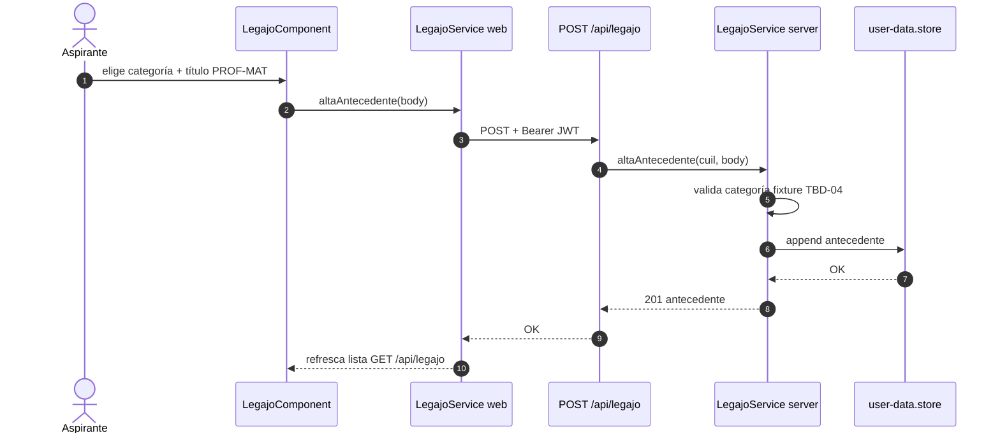
```mermaid
sequenceDiagram
  autonumber
  actor U as Aspirante
  participant LC as LegajoComponent
  participant LS as LegajoService web
  participant API as POST /api/legajo
  participant S as LegajoService server
  participant ST as user-data.store

  U->>LC: elige categoría + título PROF-MAT
  LC->>LS: altaAntecedente(body)
  LS->>API: POST + Bearer JWT
  API->>S: altaAntecedente(cuil, body)
  S->>S: valida categoría fixture TBD-04
  S->>ST: append antecedente
  ST-->>S: OK
  S-->>API: 201 antecedente
  API-->>LS: OK
  LS-->>LC: refresca lista GET /api/legajo
```

---

## 16. Secuencia — postular materia con validador

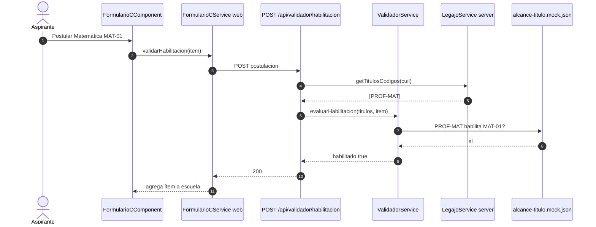
```mermaid
sequenceDiagram
  autonumber
  actor U as Aspirante
  participant FC as FormularioCComponent
  participant FS as FormularioCService web
  participant VAL as POST /api/validador/habilitacion
  participant VS as ValidadorService
  participant LG as LegajoService server
  participant ALC as alcance-titulo.mock.json

  U->>FC: Postular Matemática MAT-01
  FC->>FS: validarHabilitacion(item)
  FS->>VAL: POST postulacion
  VAL->>LG: getTitulosCodigos(cuil)
  LG-->>VAL: [PROF-MAT]
  VAL->>VS: evaluarHabilitacion(titulos, item)
  VS->>ALC: PROF-MAT habilita MAT-01?
  ALC-->>VS: sí
  VS-->>VAL: habilitado true
  VAL-->>FS: 200
  FS-->>FC: agrega ítem a escuela
```

Caso rechazo (sin título o alcance insuficiente):

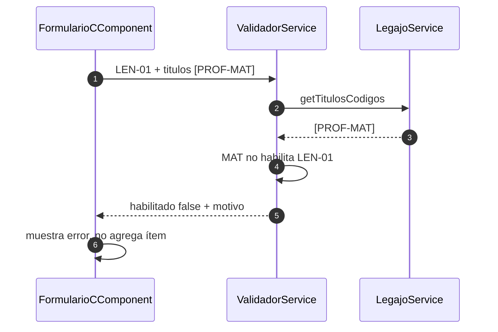
```mermaid
sequenceDiagram
  autonumber
  participant FC as FormularioCComponent
  participant VAL as ValidadorService
  participant LG as LegajoService

  FC->>VAL: LEN-01 + titulos [PROF-MAT]
  VAL->>LG: getTitulosCodigos
  LG-->>VAL: [PROF-MAT]
  VAL->>VAL: MAT no habilita LEN-01
  VAL-->>FC: habilitado false + motivo
  FC->>FC: muestra error, no agrega ítem
```

---

## 17. Secuencia — guardar Formulario C (topes + validación final)

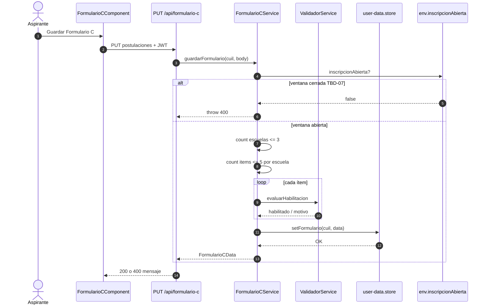
```mermaid
sequenceDiagram
  autonumber
  actor U as Aspirante
  participant FC as FormularioCComponent
  participant API as PUT /api/formulario-c
  participant FCS as FormularioCService
  participant VAL as ValidadorService
  participant ST as user-data.store
  participant ENV as env.inscripcionAbierta

  U->>FC: Guardar Formulario C
  FC->>API: PUT postulaciones + JWT
  API->>FCS: guardarFormulario(cuil, body)
  FCS->>ENV: inscripcionAbierta?
  alt ventana cerrada TBD-07
    ENV-->>FCS: false
    FCS-->>API: throw 400
  else ventana abierta
    FCS->>FCS: count escuelas <= 3
    FCS->>FCS: count items <= 5 por escuela
    loop cada ítem
      FCS->>VAL: evaluarHabilitacion
      VAL-->>FCS: habilitado / motivo
    end
    FCS->>ST: setFormulario(cuil, data)
    ST-->>FCS: OK
    FCS-->>API: FormularioCData
  end
  API-->>FC: 200 o 400 mensaje
```

---

## 18. Mapa API REST (implementado)

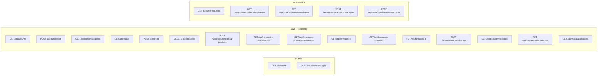
```mermaid
flowchart LR
  subgraph public [Público]
    H[GET /api/health]
    ML[POST /api/auth/mock-login]
  end

  subgraph jwt_asp [JWT — aspirante]
    ME[GET /api/auth/me]
    LO[POST /api/auth/logout]
    LC[GET /api/legajo/categorias]
    LG[GET /api/legajo]
    LA[POST /api/legajo]
    LD[DELETE /api/legajo/:id]
    LS[POST /api/legajo/sincronizar-provincia]
    FE[GET /api/formulario-c/escuelas?q=]
    FC[GET /api/formulario-c/catalogo?escuelaId=]
    FG[GET /api/formulario-c]
    FEST[GET /api/formulario-c/estado]
    FP[PUT /api/formulario-c]
    VH[POST /api/validador/habilitacion]
    PU[GET /api/puntaje/inscripcion]
    MA[GET /api/mapa/establecimientos]
    MAS[GET /api/mapa/asignaturas]
  end

  subgraph jwt_voc [JWT — vocal]
    JE[GET /api/junta/escuelas]
    JA[GET /api/junta/escuelas/:id/aspirantes]
    JL[GET /api/junta/aspirantes/:cuil/legajo]
    JOK[POST /api/junta/aspirantes/:cuil/aceptar]
    JNO[POST /api/junta/aspirantes/:cuil/rechazar]
  end
```

---

## 19. Integraciones — real vs mock (evolución)

```mermaid
flowchart TB
  subgraph hoy [Dev / MVP académico local]
    M1[usuarios.mock.json]
    M2[antecedentes.mock.json]
    M3[escuelas.mock.json]
    M4[catalogo-asignaturas.mock.json]
    M5[alcance-titulo.mock.json]
    M6[vocal-escuelas.mock.json]
    M7[puntaje.mock.json]
    M8[mapa-establecimientos.mock.json]
    M9[demo-store.seed.json]
    MEM[user-data.store JSON]
  end

  subgraph prod [Producción acordada]
    P1[CiDi OAuth2]
    P2[Oracle tablas producto]
    P3[Vista alcance título ADR-009]
    P4[Padrón escuelas TBD-02]
    P5[Motor LOM puntaje ADR-010]
    P6[Acta escuela vocal junta]
  end

  hoy -.->|reemplazar incremental| prod
```

---

## 20. Secuencia — revisión vocal (US-06)

```mermaid
sequenceDiagram
  participant V as Vocal UI /junta
  participant API as API /api/junta
  participant Store as user-data.store
  participant A as Aspirante UI /legajo

  V->>API: GET /escuelas (JWT vocal)
  API-->>V: escuelas asignadas fixture

  V->>API: GET /escuelas/ESC-001/aspirantes?estado=PENDIENTE
  API->>Store: formularios + legajos por CUIL
  API-->>V: lista aspirantes

  V->>API: POST .../rechazar { motivo, escuelaId }
  API->>Store: setLegajo aspirante RECHAZADO + observacion
  API-->>V: antecedente actualizado

  A->>API: GET /api/legajo (JWT aspirante)
  API-->>A: observacionRechazo visible
```

---

## 21. Secuencia — consulta puntaje (US-05)

```mermaid
sequenceDiagram
  participant H as Home / Puntaje UI
  participant API as API /api/puntaje
  participant FX as puntaje.mock.json

  H->>API: GET /inscripcion (JWT aspirante)
  API->>FX: valoraciones[cuil]
  alt hay valoración
    FX-->>API: filas 3 columnas + total
    API-->>H: disponible true + grilla
  else sin valoración
    API-->>H: disponible false + mensaje
  end
```

---

## 22. Secuencia — mapa Leaflet spike (PD-21)

```mermaid
sequenceDiagram
  participant U as Aspirante /mapa
  participant API as API /api/mapa
  participant FX as mapa-establecimientos.mock.json
  participant L as Leaflet browser

  U->>API: GET /asignaturas (JWT aspirante)
  API-->>U: lista para filtro

  U->>API: GET /establecimientos?asignatura=
  API->>FX: geojson + establecimientos filtrados
  API-->>U: JSON respuesta

  U->>L: geoJSON capa provincia + circleMarker por urgencia
```

---

## 23. Índice de archivos ↔ diagramas

| Diagrama | Código / doc relacionado |
|----------|--------------------------|
| Contenedores | `src/server/src/app.ts`, `src/web/` |
| Clases backend | `src/server/src/modules/*/` |
| Store memoria | `src/server/src/store/user-data.store.ts` |
| Fixtures | `src/fixtures/` |
| Rutas web | `src/web/src/app/app.routes.ts` |
| Escuela base AS-IS/TO-BE | `docs/adr/` · `SCM.md` |
| Reglas y decisiones técnicas | `docs/adr/` · `SCM.md` |

---

## Cómo exportar a imagen (opcional)

Desde VS Code o [mermaid.live](https://mermaid.live):

1. Copiar bloque ` ```mermaid ` … ` ``` `
2. Exportar PNG/SVG (informe o entrega).

Basado en ADRs, SCM y código en `src/`. Lo punteado es TBD.
