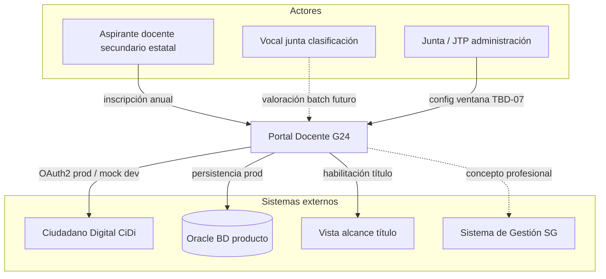

# Contexto del sistema (C4 — nivel 1)

```mermaid
flowchart TB
  subgraph actores [Actores]
    ASP[Aspirante docente secundario estatal]
    VOC[Vocal junta clasificación]
    JTP[Junta / JTP administración]
  end

  subgraph externos [Sistemas externos]
    CIDI[Ciudadano Digital CiDi]
    ORA[(Oracle BD producto)]
    VISTA[Vista alcance título]
    SG[Sistema de Gestión SG]
  end

  PORTAL[Portal Docente G24]

  ASP -->|inscripción anual| PORTAL
  VOC -.->|valoración batch futuro| PORTAL
  JTP -->|config ventana TBD-07| PORTAL

  PORTAL -->|OAuth2 prod / mock dev| CIDI
  PORTAL -->|persistencia prod| ORA
  PORTAL -->|habilitación título| VISTA
  PORTAL -.->|concepto profesional| SG
```

---

---

[← Índice diagramas](./README.md) · [Documento completo](../DIAGRAMAS_MVP.md)
