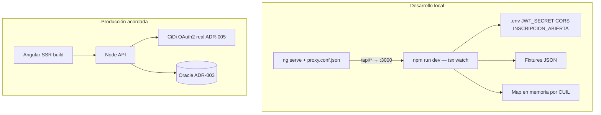

# Despliegue local vs producción

```mermaid
flowchart TB
  subgraph dev [Desarrollo local]
    NG[ng serve + proxy.conf.json]
    API[npm run dev — tsx watch]
    ENV[.env JWT_SECRET CORS INSCRIPCION_ABIERTA]
    FX[Fixtures JSON]
    MEM[Map en memoria por CUIL]
  end

  subgraph prod [Producción acordada]
    SSR[Angular SSR build]
    NODE[Node API]
    OAUTH[CiDi OAuth2 real ADR-005]
    ORA[(Oracle ADR-003)]
  end

  NG -->|/api/* → :3000| API
  API --> ENV
  API --> FX
  API --> MEM

  SSR --> NODE
  NODE --> OAUTH
  NODE --> ORA
```

---

---

[← Índice diagramas](./README.md) · [Documento completo](../DIAGRAMAS_MVP.md)
