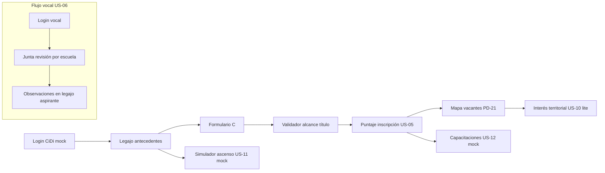
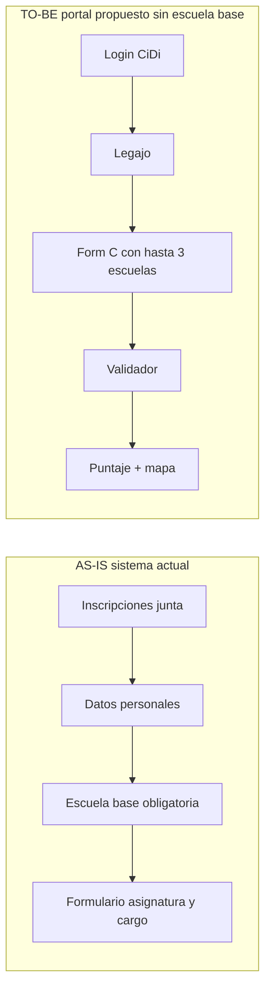

# Cadena de negocio TO-BE (MVP codeado)

```mermaid
flowchart LR
  A[Login CiDi mock] --> B[Legajo antecedentes]
  B --> C[Formulario C]
  C --> D[Validador alcance título]
  D --> E[Puntaje inscripción US-05]
  E --> F[Mapa vacantes PD-21]
  F --> G[Interés territorial US-10 lite]
  B --> H[Simulador ascenso US-11 mock]
  E --> I[Capacitaciones US-12 mock]

  subgraph vocal [Flujo vocal US-06]
    V[Login vocal] --> J[Junta revisión por escuela]
    J --> O[Observaciones en legajo aspirante]
  end
```

Comparación AS-IS legacy (solo referencia):

```mermaid
flowchart LR
  subgraph asis [AS-IS sistema actual]
    L1[Inscripciones junta] --> L2[Datos personales]
    L2 --> L3[Escuela base obligatoria]
    L3 --> L4[Formulario asignatura y cargo]
  end

  subgraph tobe [TO-BE portal propuesto sin escuela base]
    T1[Login CiDi] --> T2[Legajo]
    T2 --> T3[Form C con hasta 3 escuelas]
    T3 --> T4[Validador]
    T4 --> T5[Puntaje + mapa]
  end
```

---

[← Índice diagramas](./README.md) · [Documento completo](../DIAGRAMAS_MVP.md)
