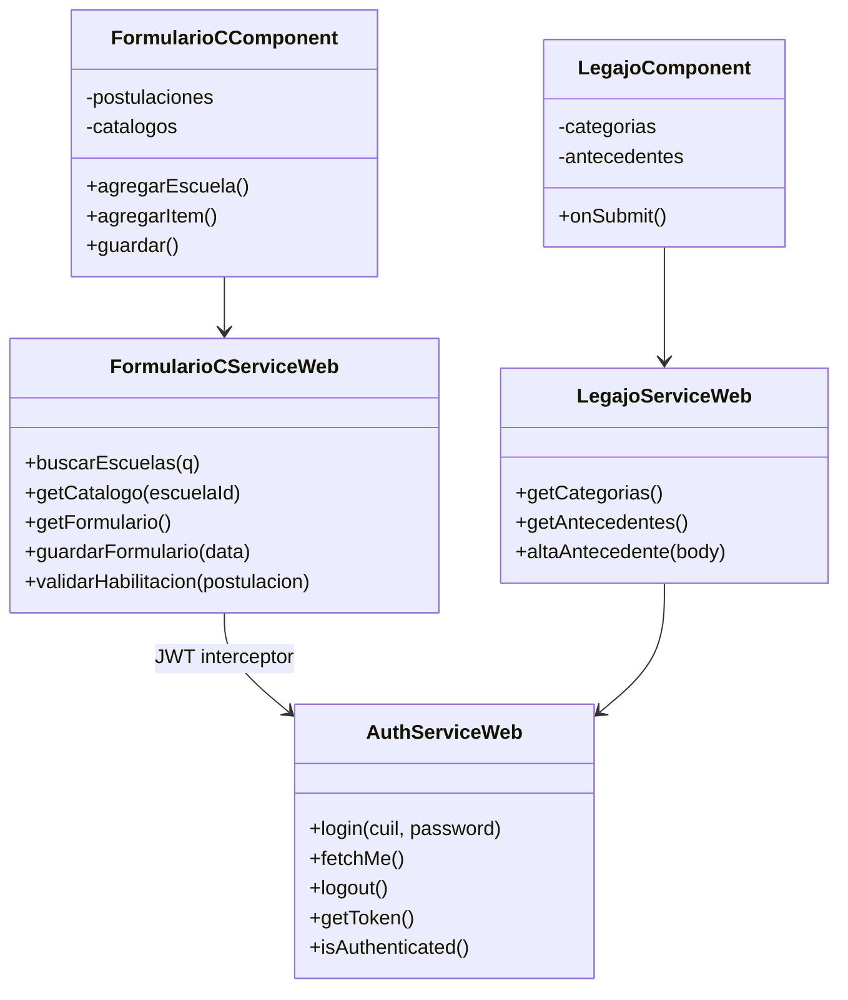

# Diagrama de clases — frontend

```mermaid
classDiagram
  class AuthServiceWeb {
    +login(cuil, password)
    +fetchMe()
    +logout()
    +getToken()
    +isAuthenticated()
  }

  class LegajoServiceWeb {
    +getCategorias()
    +getAntecedentes()
    +altaAntecedente(body)
  }

  class FormularioCServiceWeb {
    +buscarEscuelas(q)
    +getCatalogo(escuelaId)
    +getFormulario()
    +guardarFormulario(data)
    +validarHabilitacion(postulacion)
  }

  class LegajoComponent {
    -categorias
    -antecedentes
    +onSubmit()
  }

  class FormularioCComponent {
    -postulaciones
    -catalogos
    +agregarEscuela()
    +agregarItem()
    +guardar()
  }

  LegajoComponent --> LegajoServiceWeb
  FormularioCComponent --> FormularioCServiceWeb
  FormularioCServiceWeb --> AuthServiceWeb : JWT interceptor
  LegajoServiceWeb --> AuthServiceWeb
```

---

---

[← Índice diagramas](./README.md) · [Documento completo](../DIAGRAMAS_MVP.md)
