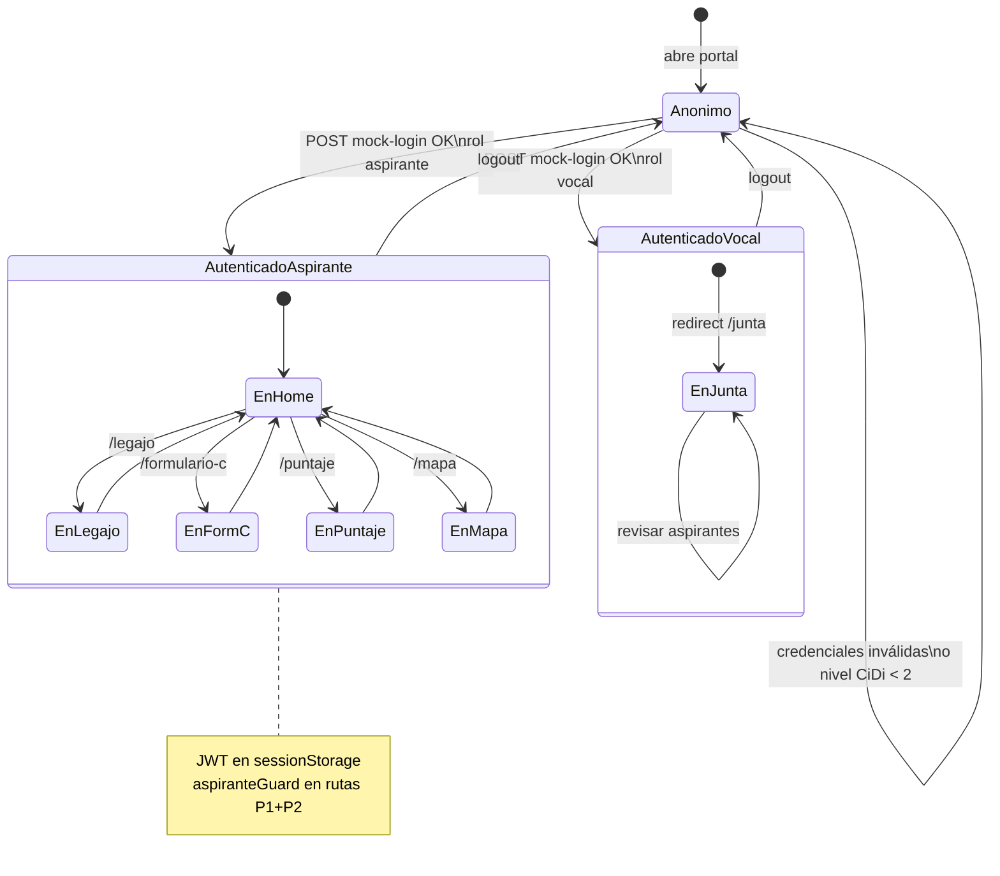

# Estados — sesión del aspirante y vocal

```mermaid
stateDiagram-v2
  [*] --> Anonimo : abre portal

  Anonimo --> AutenticadoAspirante : POST mock-login OK\nrol aspirante
  Anonimo --> AutenticadoVocal : POST mock-login OK\nrol vocal
  Anonimo --> Anonimo : credenciales inválidas\no nivel CiDi < 2

  state AutenticadoAspirante {
    [*] --> EnHome
    EnHome --> EnLegajo : /legajo
    EnLegajo --> EnHome
    EnHome --> EnFormC : /formulario-c
    EnFormC --> EnHome
    EnHome --> EnPuntaje : /puntaje
    EnPuntaje --> EnHome
    EnHome --> EnMapa : /mapa
    EnMapa --> EnHome
  }

  state AutenticadoVocal {
    [*] --> EnJunta : redirect /junta
    EnJunta --> EnJunta : revisar aspirantes
  }

  AutenticadoAspirante --> Anonimo : logout
  AutenticadoVocal --> Anonimo : logout

  note right of AutenticadoAspirante
    JWT en sessionStorage
    aspiranteGuard en rutas P1+P2
  end note
```

---

[← Índice diagramas](./README.md) · [Documento completo](../DIAGRAMAS_MVP.md)
