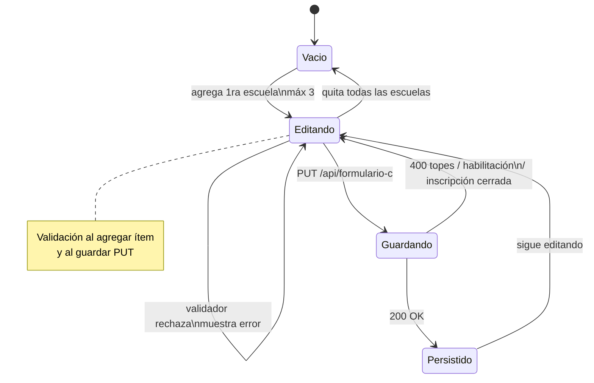

# Estados — Formulario C (UI + persistencia)

```mermaid
stateDiagram-v2
  [*] --> Vacio

  Vacio --> Editando : agrega 1ra escuela\nmáx 3
  Editando --> Editando : agrega ítem\nvalidador OK\nmáx 5 por escuela
  Editando --> Editando : validador rechaza\nmuestra error
  Editando --> Vacio : quita todas las escuelas

  Editando --> Guardando : PUT /api/formulario-c
  Guardando --> Persistido : 200 OK
  Guardando --> Editando : 400 topes / habilitación\n/ inscripción cerrada

  Persistido --> Editando : sigue editando

  note right of Editando
    Validación al agregar ítem
    y al guardar PUT
  end note
```

---

---

[← Índice diagramas](./README.md) · [Documento completo](../DIAGRAMAS_MVP.md)
