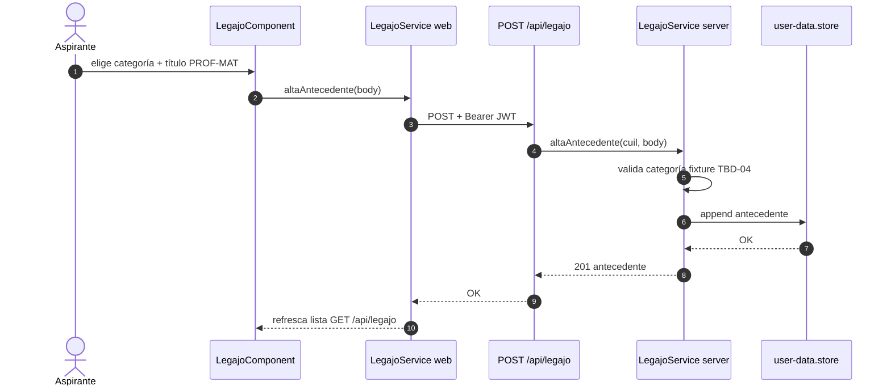

# Secuencia — registrar antecedente

```mermaid
sequenceDiagram
  autonumber
  actor U as Aspirante
  participant LC as LegajoComponent
  participant LS as LegajoService web
  participant API as POST /api/legajo
  participant S as LegajoService server
  participant ST as user-data.store

  U->>LC: elige categoría + título PROF-MAT
  LC->>LS: altaAntecedente(body)
  LS->>API: POST + Bearer JWT
  API->>S: altaAntecedente(cuil, body)
  S->>S: valida categoría fixture TBD-04
  S->>ST: append antecedente
  ST-->>S: OK
  S-->>API: 201 antecedente
  API-->>LS: OK
  LS-->>LC: refresca lista GET /api/legajo
```

---

---

[← Índice diagramas](./README.md) · [Documento completo](../DIAGRAMAS_MVP.md)
