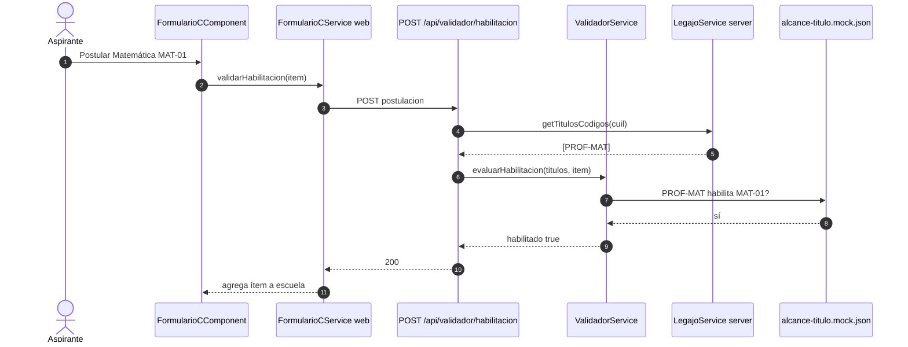
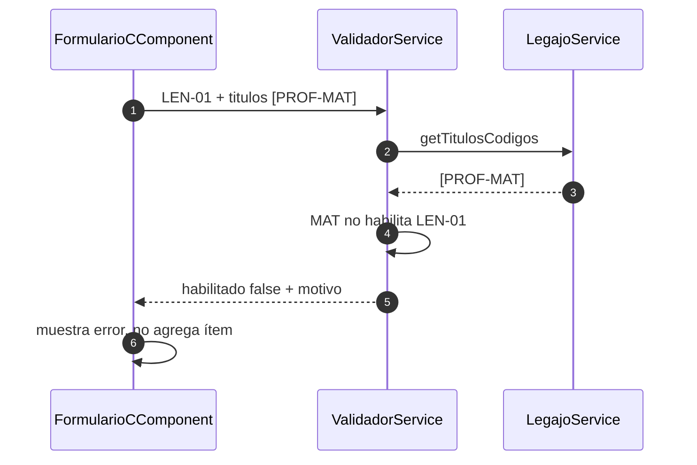

# Secuencia — postular materia con validador

```mermaid
sequenceDiagram
  autonumber
  actor U as Aspirante
  participant FC as FormularioCComponent
  participant FS as FormularioCService web
  participant VAL as POST /api/validador/habilitacion
  participant VS as ValidadorService
  participant LG as LegajoService server
  participant ALC as alcance-titulo.mock.json

  U->>FC: Postular Matemática MAT-01
  FC->>FS: validarHabilitacion(item)
  FS->>VAL: POST postulacion
  VAL->>LG: getTitulosCodigos(cuil)
  LG-->>VAL: [PROF-MAT]
  VAL->>VS: evaluarHabilitacion(titulos, item)
  VS->>ALC: PROF-MAT habilita MAT-01?
  ALC-->>VS: sí
  VS-->>VAL: habilitado true
  VAL-->>FS: 200
  FS-->>FC: agrega ítem a escuela
```

Caso rechazo (sin título o alcance insuficiente):

```mermaid
sequenceDiagram
  autonumber
  participant FC as FormularioCComponent
  participant VAL as ValidadorService
  participant LG as LegajoService

  FC->>VAL: LEN-01 + titulos [PROF-MAT]
  VAL->>LG: getTitulosCodigos
  LG-->>VAL: [PROF-MAT]
  VAL->>VAL: MAT no habilita LEN-01
  VAL-->>FC: habilitado false + motivo
  FC->>FC: muestra error, no agrega ítem
```

---

---

[← Índice diagramas](./README.md) · [Documento completo](../DIAGRAMAS_MVP.md)
