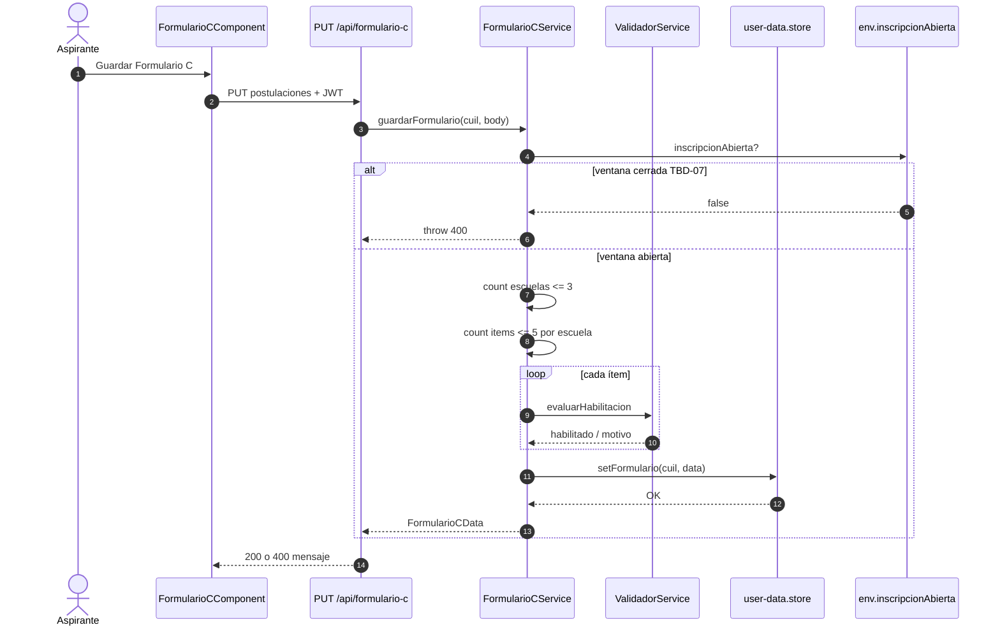

# Secuencia — guardar Formulario C (topes + validación final)

```mermaid
sequenceDiagram
  autonumber
  actor U as Aspirante
  participant FC as FormularioCComponent
  participant API as PUT /api/formulario-c
  participant FCS as FormularioCService
  participant VAL as ValidadorService
  participant ST as user-data.store
  participant ENV as env.inscripcionAbierta

  U->>FC: Guardar Formulario C
  FC->>API: PUT postulaciones + JWT
  API->>FCS: guardarFormulario(cuil, body)
  FCS->>ENV: inscripcionAbierta?
  alt ventana cerrada TBD-07
    ENV-->>FCS: false
    FCS-->>API: throw 400
  else ventana abierta
    FCS->>FCS: count escuelas <= 3
    FCS->>FCS: count items <= 5 por escuela
    loop cada ítem
      FCS->>VAL: evaluarHabilitacion
      VAL-->>FCS: habilitado / motivo
    end
    FCS->>ST: setFormulario(cuil, data)
    ST-->>FCS: OK
    FCS-->>API: FormularioCData
  end
  API-->>FC: 200 o 400 mensaje
```

---

---

[← Índice diagramas](./README.md) · [Documento completo](../DIAGRAMAS_MVP.md)
