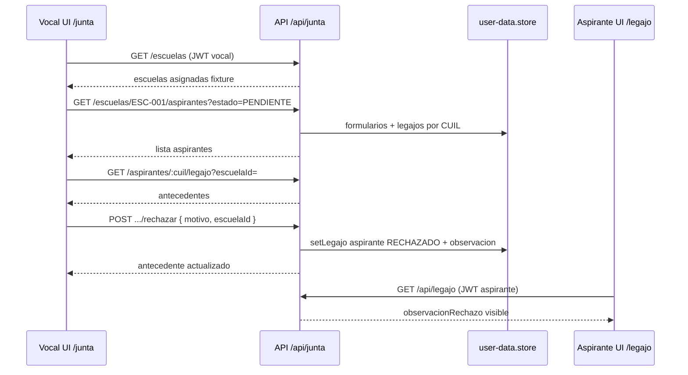

# Secuencia — revisión vocal (US-06)

```mermaid
sequenceDiagram
  participant V as Vocal UI /junta
  participant API as API /api/junta
  participant Store as user-data.store
  participant A as Aspirante UI /legajo

  V->>API: GET /escuelas (JWT vocal)
  API-->>V: escuelas asignadas fixture

  V->>API: GET /escuelas/ESC-001/aspirantes?estado=PENDIENTE
  API->>Store: formularios + legajos por CUIL
  API-->>V: lista aspirantes

  V->>API: GET /aspirantes/:cuil/legajo?escuelaId=
  API-->>V: antecedentes

  V->>API: POST .../rechazar { motivo, escuelaId }
  API->>Store: setLegajo aspirante RECHAZADO + observacion
  API-->>V: antecedente actualizado

  A->>API: GET /api/legajo (JWT aspirante)
  API-->>A: observacionRechazo visible
```

---

[← Índice diagramas](./README.md) · [Documento completo](../DIAGRAMAS_MVP.md)
