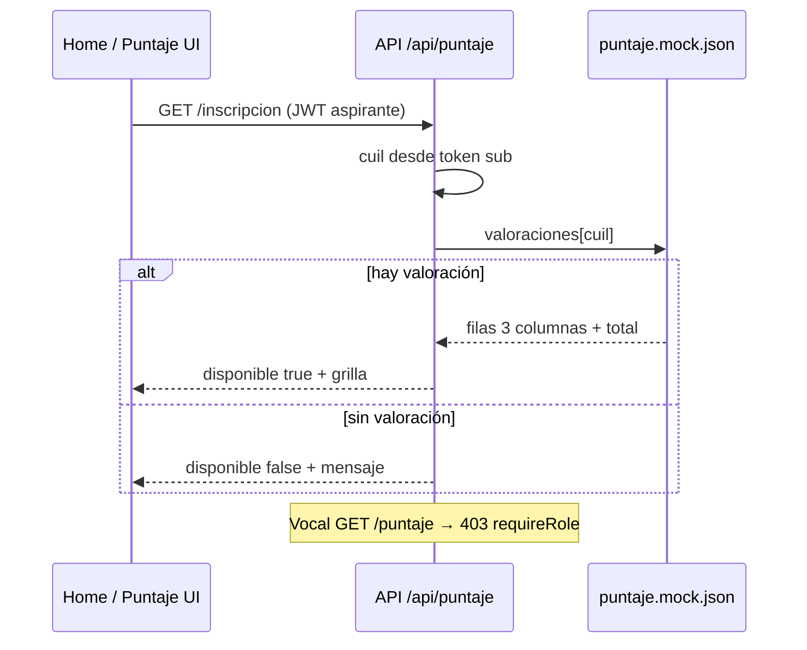

# Secuencia — consulta puntaje (US-05)

```mermaid
sequenceDiagram
  participant H as Home / Puntaje UI
  participant API as API /api/puntaje
  participant FX as puntaje.mock.json

  H->>API: GET /inscripcion (JWT aspirante)
  API->>API: cuil desde token sub
  API->>FX: valoraciones[cuil]
  alt hay valoración
    FX-->>API: filas 3 columnas + total
    API-->>H: disponible true + grilla
  else sin valoración
    API-->>H: disponible false + mensaje
  end

  Note over API: Vocal GET /puntaje → 403 requireRole
```

---

[← Índice diagramas](./README.md) · [Documento completo](../DIAGRAMAS_MVP.md)
