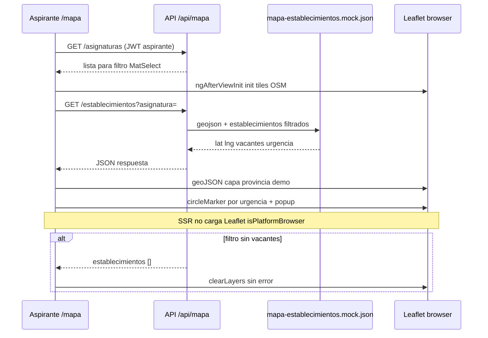

# Secuencia — mapa Leaflet spike (PD-21)

```mermaid
sequenceDiagram
  participant U as Aspirante /mapa
  participant API as API /api/mapa
  participant FX as mapa-establecimientos.mock.json
  participant L as Leaflet browser

  U->>API: GET /asignaturas (JWT aspirante)
  API-->>U: lista para filtro MatSelect

  U->>L: ngAfterViewInit init tiles OSM
  U->>API: GET /establecimientos?asignatura=
  API->>FX: geojson + establecimientos filtrados
  FX-->>API: lat lng vacantes urgencia
  API-->>U: JSON respuesta

  U->>L: geoJSON capa provincia demo
  U->>L: circleMarker por urgencia + popup

  Note over U,L: SSR no carga Leaflet isPlatformBrowser

  alt filtro sin vacantes
    API-->>U: establecimientos []
    U->>L: clearLayers sin error
  end
```

---

[← Índice diagramas](./README.md) · [Trazabilidad P2](../TRAZABILIDAD_SPRINT_P2.md)
